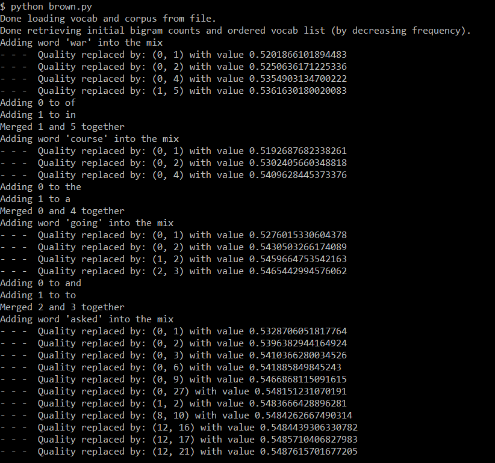

### Brown Clustering

#### Dependencies
* python 3
* sklearn.feature_extraction.text (CountVectorizer)
* nltk (RegexpTokenizer)
* data folder and training folder

#### Instructions
* Run `python create_inputs.py` which generates 
   * `data/cleaned_corpus.txt`: Cleaned corpus after lower-casing, removing 'UNK', stemming 
   * `data/results-brown.txt`:  Ranked vocab with frequency
* Run `python brown.py`

#### Output

### Word2Vec Clustering 

#### Dependencies
* python 3
* gensim (models)
* data ('GoogleNews-vectors-negative300.bin.gz' can be downloaded [here](https://drive.google.com/file/d/0B7XkCwpI5KDYNlNUTTlSS21pQmM/edit?usp=sharing))

#### Instructions
* Run `python word2vec.py`
* Interactive console that will ask for multiple words
   * Empty input will end prompts

